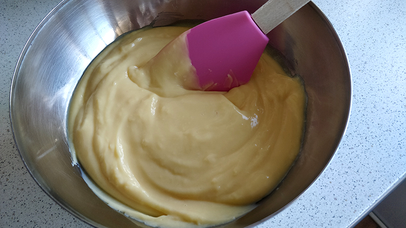

## Crema pastelera

**Ingredientes**

- 500 ml de leche entera 
- 100 g de azúcar
- 4 yemas de huevo M/L
- 40 g de harina de maíz
- 1 rama de canela
- Piel de limón 

**Preparación**

Ponemos en un cazo la leche, la canela y la piel de limón. Ponemos a hervir, removiendo de vez en cuando para que la leche no se pegue al fondo del cazo. Cuando comience a hervir, retiramos del fuego, tapamos y dejamos infusionar unos minutos.

Mientras, en un bol ponemos el azúcar, la harina de maíz y las yemas de huevo. Mezclamos con unas varillas a mano hasta que la mezcla quede blanquecina. 

Cuando la leche se haya templado un poco le quitamos la canela y el limón, y la añadimos, despacio y sin dejar de batir, a la mezcla de yemas, azúcar y harina de maíz. Volvemos a poner la mezcla en el cazo y calentamos a fuego medio, sin parar de remover hasta que espese, unos 2-3 minutos. 

La ponemos en un bol y la tapamos con papel film, que toque la superficie de la crema para evitar que se forme una costra. Dejamos enfriar y llevamos al frigorífico hasta el momento de utilizar. 

**Notas**

Podemos conservarla 2-3 días en la nevera.

La leche debe ser entera, para que nos aporte cremosidad. También podemos sustituir una cuarta parte de la leche por nata líquida para hacerla aún más cremosa.

El azúcar puede ser el normal, pero si queremos que la textura sea aún más suave, podemos utilizar azúcar glas.

El utensilio más indicado para hacer la crema pastelera son unas varillas, ni cuchara de madera ni nada. Con las varillas será más fácil evitar que se formen grumos en la crema.

Para que la crema espese en la cocción se puede usar harina de trigo, harina de maíz o fécula de patata, o una combinación. La harina de trigo se suele utilizar cuando se vaya a usar la crema para cubrir masa de hojaldre o similar. La harina de maíz cuando se vaya a usar para rellenos. Y una combinación de harina de trigo y maíz o fécula de patata cuando se vaya a usar en pasteles con frutas.

Si queremos aromatizarla con vainas de vainilla, las abrimos con la punta de un cuchillo y la raspamos para sacar las semillas. Lo pondremos todo en la leche, la vaina y las semillas. Si no tenemos vainas podemos usar extracto de vainilla, que lo añadiremos cuando la crema esté hecha, o usar pasta de vainilla, que la añadiremos junto con la leche. Pero en ambos casos no será necesario que dejemos infusionar la leche.

Una vez que la crema esté hecha y aún caliente, podemos añadir chocolate finamente picado o una cucharada de Nutella, y tendremos una crema pastelera de chocolate.

También podemos aromatizar la leche con piel de naranja; o con una cucharadita de café soluble (no hace falta dejar infusionar el café).

**Recetas que utilizan crema pastelera**

- [Canutillos de hojaldre](../dulce/canutillos-de-hojaldre.md)
- [Roscón de Reyes](../dulce/roscon-de-reyes.md)
- [Roscón de Reyes - Otra versión](../dulce/roscon-reyes-otra-version.md)
- [Tarta de galletas, chocolate y crema pastelera](../dulce/tarta-de-galletas-chocolate-y-crema-pastelera.md)

**Receta de:** DeNIKAtessen y Sophie Bakery