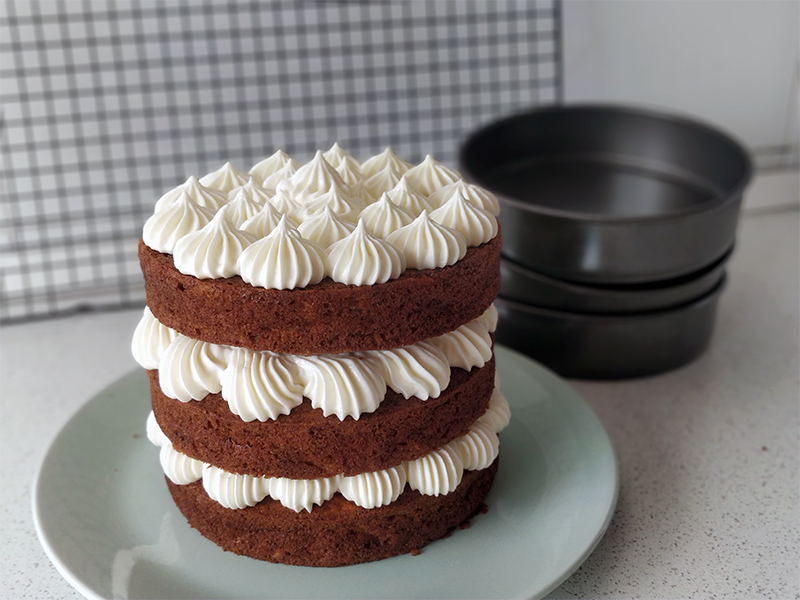

##Carrot Cake - Tarta de zanahoria

**Ingredientes**

*Para 3 moldes de 15 cm de diámetro*

- 210 g de harina de trigo
- 3 huevos camperos M/L
- 1 cucharadita (teaspoon) de bicarbonato
- 180 ml de aceite de oliva suave o de girasol
- 2 cucharaditas (teaspoons) de canela molida
- 225 g de zanahorias
- 210 g de manzana
- 180 g de azúcar
- Un buen puñado (unos 85 g) de nueces peladas y picadas

*Para la crema de queso*

- 125 g de mantequilla sin sal a temperatura ambiente, muy blanda
- 300 g de azúcar superfino (icing sugar)
- 200 g de queso de untar, muy frío (tipo Philadelphia)

**Preparación**

*Para los bizcochos*

En un bol mezclamos el aceite con el azúcar, podemos hacerlo a mano con unas varillas o con la batidora o amasadora (con la amasadora usaremos la pala). Añadimos los huevos y mezclamos bien. Cuando esté bien integrado, añadimos la harina tamizada junto con el bicarbonato y la canela. Removemos con cuidado hasta que se integre por completo.

La zanahoria y la manzana tienen que estar picadas o ralladas, pero no hechas puré, ya que queremos que el bizcocho tenga miga, no sea denso tipo pudin. Incorporamos la zanahoria y la manzana al bol de nuestra masa e integramos bien, con ayuda de una espátula mejor que con la varilla. Por último añadimos las nueces y mezclamos bien.

Engrasamos los moldes con spray o mantequilla o aceite. Repartimos la masa de forma equitativa, por ejemplo, con ayuda de una cuchara para helados. Llevaremos al horno, a 180 ºC, con calor arriba y abajo, unos 25 minutos. Comprobaremos que están hechos cuando al pincharlos con un palillo, éste salga limpio. Dejamos enfriar los bizcochos sobre una rejilla. Cuidado al desmoldarlos porque son muy tiernos.

*Para la crema*

Mientras terminan de enfriarse los bizcochos, preparamos la crema de queso. Ponemos la mantequilla muy blandita en el bol de la amasadora, o en un bol para batir con la batidora de varillas. Añadimos el icing sugar tamizado y batimos en la amasadora con las varillas, primero más despacio para que no salga todo el azúcar volando, y poco a poco vamos subiendo la velocidad. Iremos repasando las paredes del bol con una espátula para que no quede mantequilla sin integrar. Cuando la mantequilla y el azúcar estén perfectamente integrados, añadimos el queso, muy frío. Batimos de nuevo. Al principio estará amarillenta, blandita, aún no la podríamos usar con manga pastelera. Así que rebañamos las paredes del bol y batimos a máxima velocidad hasta que la crema adquiera un color blanco y una textura esponjosa y aireada.

*Para el montaje y decoración*

Preparamos una manga pastelera con una boquilla, redonda, o la que tengamos, y rellenamos con la crema de queso.

Para montar la tarta colocamos uno de los bizcochos, con la parte más plana, en el plato o stand donde vayamos a presentar la tarta. Añadimos crema de queso con la manga pastelera, de la forma que queramos. Colocamos el segundo bizcocho, cuidando de que estén centrados, y repetimos con el queso. Colocamos el último piso de bizcocho y terminamos de decorar con la crema de queso. También podemos añadir algunas medias nueces para terminar de decorar.

**Notas**

Si nos gustan, también podemos añadir un puñadito de pasas junto con las nueces.

Las nueces puedes ser normales o pecanas.

En la crema de queso también podemos usar queso Mascarpone.

Si para la crema de queso no queremos usar ni mantequilla ni azúcar, podemos batir el queso crema con nata o el mascarpone con nata hasta que monte, y nos quedará una crema bastante densa que también podremos utilizar para decorar, y menos dulce.

Para darle un toque diferente a la crema, podemos añadir ralladura de naranja, canela, crema de Lotus, cardamomo o cacao.

También podríamos hornear la masa en un molde loaf, puede que la masa dé para dos bizcochos de ese tamaño. O en dos moldes de 18 cm de layer cake.

**Molde utilizado:** [moldes de layer cake de 15 cm de diámetro](../../moldes-y-utensilios.md)

**Receta de:** [Alma Obregón (video)](https://www.youtube.com/watch?v=2g-Wz11Och8)