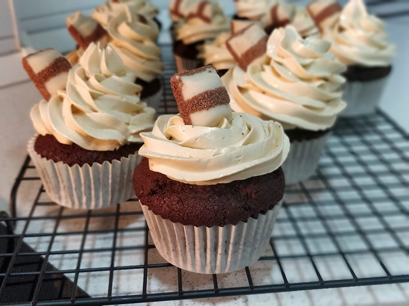

## Cupcakes de Kinder Bueno

**Ingredientes**

- 100 ml de aceite de oliva suave
- 2 huevos
- 120 g de azúcar moreno
- 115 ml de nata líquida 35% m.g.
- 120 g de harina
- 35 g de cacao puro en polvo
- 1 cucharadita (teaspoon) de levadura química
- 1/2 cucharadita (teaspoon) de bicarbonato sódico
- Un par de cucharaditas hermosas de pasta de avellana italiana

*Para la crema de mantequilla francesa con avellana*

- 3 yemas de huevo
- 45 ml de agua
- 135 g de azúcar blanco
- 210 g de mantequilla a temperatura ambiente
- 3 cucharadas (tablespoons) de pasta de avellana italiana

**Preparación**

*De los bizcochos*

Preparamos una bandeja para cupcakes con los papelitos. Calentamos el horno con calor arriba y abajo a 180 ºC. 

En un bol mezclamos el aceite con el azúcar moreno y mezclamos muy bien con una varillas a mano. Añadimos los huevos y volvemos a mezclar. A continuación, añadimos la harina tamizada con el cacao, la levadura y el bicarbonato. Vamos mezclando poco a poco y, según se vaya incorporando, añadimos la nata en dos veces. Removemos bien hasta tener una masa homogénea. Por último, añadimos la pasta de avellana italiana, y removemos hasta integrar.

También podemos batirlo todo con batidora, pero siempre a la velocidad mínima, porque no necesita tanto aire como cuando batimos mantequilla con azúcar. Nos quedarán unos bizcochos más ligeros si no nos pasamos con el batido, sobre todo después de añadir la harina.

Repartimos la masa en las cápsulas con ayuda de una cuchara de helado, o como nos sea más cómodo. Llevamos al horno unos 20 minutos.

*De la crema*

Ponemos a batir las yemas en el bol de la Kitchenaid con el accesorio de varillas.

Por otro lado, en un cazo ponemos el azúcar y el agua, que empape todo el azúcar, pero no removeremos. Ponemos el cazo a calentar hasta que alcance los 118 ºC. Una vez que alcance la temperatura, volcamos con cuidado sobre las yemas, que se seguirán batiendo, con cuidado de que el almíbar no caiga sobre las varillas, o pondrá todo perdido. Así las yemas se cocinarán y estabilizarán. Al estar tan caliente, dejaremos que siga batiendo hasta que el bol esté tibio, que no queme, o al añadir la mantequilla ésta se derretirá.

Una vez que el bol se ha enfriado, podemos ir añadiendo la mantequilla poco a poco. Una vez que la tengamos toda incorporada, subiremos la velocidad de batido para que la crema emulsione y quede una crema muy esponjosa. Por último, añadiremos las cucharadas de pasta de avellana italiana y batiremos hasta integrar por completo.

*Montaje*

Una vez estén los cupcakes fríos, los decoramos con la crema, poniéndola en una manga pastelera con la boquilla que tengamos. Yo he usado la 1M de Wilton. Para terminar, podemos colocar un trocito de Kinder Bueno sobre cada uno.

**Notas**

Las cantidades de la crema se pueden doblar y hacer más cantidad porque se puede congelar sin problemas. Para utilizarla después, bastará con dejarla descongelar por completo a temperatura ambiente y batir de nuevo perfectamente. Crema como recién hecha.

A la crema también se le puede añadir, en vez de la pasta de avellana italiana, Nutella, Nocilla, vainilla, chocolate blanco, chocolate negro, etc.

**Molde utilizado:** [bandeja para cupcakes o muffins](../../moldes-y-utensilios.md)

**Receta de:** Alma Obregón [(vídeo de los cupcakes)](https://www.youtube.com/watch?v=wtvPTMFW9cQ), [(vídeo de la crema de mantequilla francesa)](https://www.youtube.com/watch?v=UHLXQRNY2Z4)