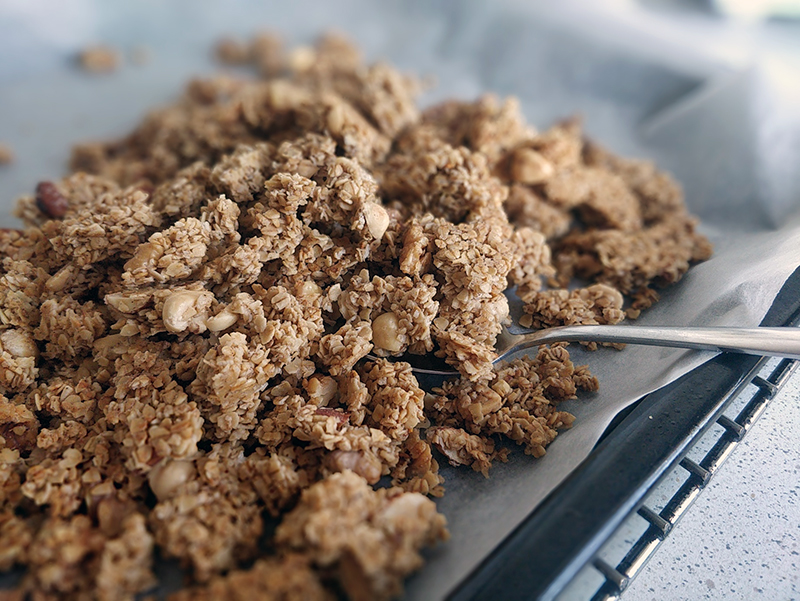

## Granola casera

**Ingredientes**

- 200 g de copos de avena
- 80 g de frutos secos variados troceados (nueces, avellanas y almendras, por ejemplo)
- 1/4 cucharadita (teaspoon) de canela molida
- 1/4 cup (60 ml) de sirope de arce
- 3 cucharadas (tablespoons o 45 ml) de aceite de girasol
- 1/2 cucharadita (teaspoon) de extracto natural de vainilla
- 1/8 cucharadita (teaspoon) de sal
- 60 g de pasas 

**Preparación**

Precalentamos el horno a 165 ºC, con calor arriba y abajo. Preparamos una bandeja cubierta con papel de hornear. Reservamos.

En un bol mezclamos los copos de avena, las almendras, nueces, avellanas y la canela.

En otro bol mezclamos el sirope de arce, el aceite, el extracto de vainilla y la sal. Vertemos sobre los copos y mezclamos muy bien hasta que esté todo bien repartido y bien recubierto.

Ponemos toda la mezcla sobre la bandeja y la repartimos uniformemente por toda la superficie hasta conseguir un grosor de 1 cm. Con una espátula, presionamos bien la granola para que quede compactada si queremos conseguir clusters o pegotes.

Horneamos a 165º C durante 25-30 minutos hasta que esté dorado.

Retiramos del horno y dejamos enfriar la granola en la misma bandeja sobre una rejilla. Una vez completamente fría, rompemos la granola tanto como queramos, añadir las pasas, mezclamos bien y la guardamos en un bote hermético.

**Notas**

Las proporciones y los ingredientes son una base de la que partir. Podemos utilizar otras frutas deshidratadas, otros frutos secos, otros copos de cereales y otras especias, según nuestro gusto.

En lugar de sirope de arce podemos utilizar miel o una combinación de sirope de arce y azúcar moreno claro. Y en lugar de aceite de girasol podemos utilizar un aceite de oliva suave o incluso mantequilla derretida.

**Receta de:** DeNIKAtessen