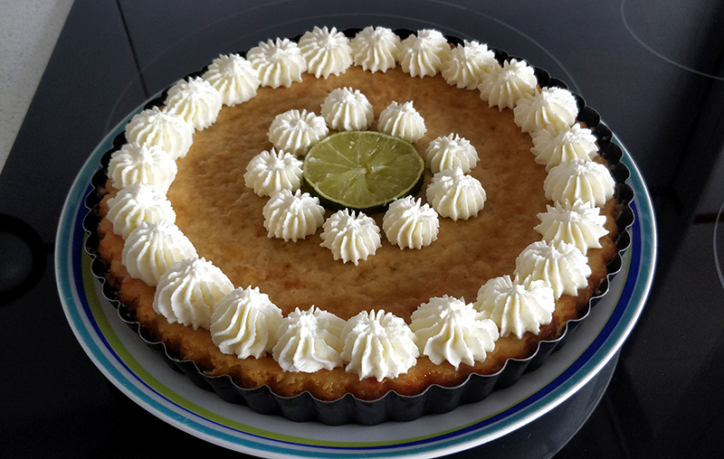

## Key Lime Pie - Tartaleta de lima

**Ingredientes**

*Para la base*

- 125 g de galletas tipo *Digestive*
- 30 g de azúcar blanco
- 70 g de mantequilla derretida

*Para el relleno*

- 4 yemas de huevo M
- 390 g de leche condensada
- 120 ml de zumo de lima
- 2 cucharaditas (teaspoons) de ralladura de lima

*Para decorar*

- 200 ml de nata para montar
- Azúcar glass al gusto
- Ralladura de lima

**Preparación**

*De la base*

Trituramos las galletas con una picadora o procesador de alimentos. Las mezclamos en un bol con el azúcar blanco y la mantequilla derretida hasta que toda la galleta quede bien impregnada. Pasamos la mezcla al molde que vayamos a usar, y repartimos e igualamos bien con la ayuda de una cuchara, aplastando hasta formar una base. Incluso podemos subir un poco por las paredes del molde. Dejamos reposar en la nevera mientras preparamos el relleno.

*Del relleno*

Precalentamos el horno a 180 ºC, con calor arriba y abajo.

Para el relleno lo primero será montar las yemas. Las ponemos en el bol de la amasadora equipada con las varillas, o en un bol y montamos con la batidora de varillas. Mientras batimos, sacamos la ralladura de una o dos limas y el zumo de las limas.

Cuando las yemas se hayan aclarado y esponjado, añadimos la leche condensada mientras seguimos batiendo. A continuación, sin dejar de batir, añadimos el zumo y la ralladura de lima. Mezclamos bien. Cogemos la base que teníamos reservada, volvamos la masa del relleno, igualamos y llevamos al horno, hasta que esté cuajada, unos 20-25 minutos. Una vez pasado el tiempo, retiramos y dejamos enfriar a temperatura ambiente. Luego podemos dejarla enfriar también en la nevera.

*Para decorar*

Cortamos una rodaja de lima que pondremos en el centro de la tarta. Por otro lado, montamos la nata, que tiene que estar bien fría para que monte mejor. Añadimos un poquito de azúcar glass, a gusto. Cuando la nata esté montada, la pasamos a una manga pastelera con la boquilla que queramos, y decoramos. Por encima podemos añadir un poco de ralladura de lima.

**Notas**

Podemos cambiar las limas por naranjas, naranjas sanguinas, mandarinas, pomelos, limones, limas y limones juntos, etc., incluso con zumo de fresas.

Yo he usado un molde desmoldable de 23 cm, pero en la receta original usa uno de 20 o 22 cm, y queda más gordita.

También se puede decorar con merengue suizo tostado, en vez de nata.

**Molde utilizado:** [redondo acanalado desmoldable de 23 cm](../../moldes-y-utensilios.md)

**Receta de:** [Alma Obregón](https://www.youtube.com/watch?v=29lvxypNdoM)