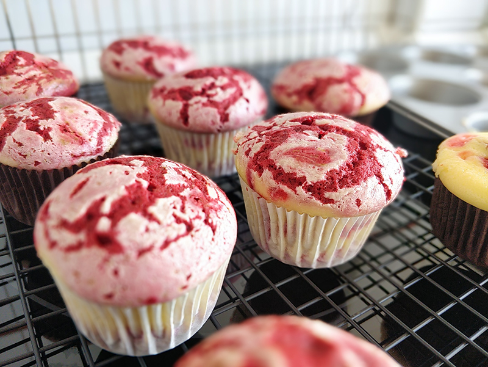

## Muffins Red Velvet Cheesecake

**Ingredientes**

*Para el cheesecake*

- 150 g de queso crema frío
- 60 g de azúcar
- 1 huevo

*Para el red velvet*

- 35 ml de leche + 1/2 cucharadita (teaspoon) de zumo de limón (o 35 ml de buttermilk)
- 140 g de harina de trigo
- 1 cucharada (tablespoon) de cacao puro en polvo
- 80 ml de aceite de oliva suave o girasol
- 80 g de azúcar
- 1 huevo
- Colorante en pasta "rojo extra"
- 1 cucharadita (teaspoon) de vinagre
- 1/2 cucharadita (teaspoon) de bicarbonato sódico

**Preparación**

Precalentamos el horno a 180 ºC, con calor arriba y abajo. Preparamos la bandeja para muffins con los papelitos. Reservamos.

En un bol mezclamos con unas varillas, a mano, el aceite con el azúcar. Añadimos el huevo y la vainilla. Incorporamos la harina tamizada con el cacao y, después de empezar a mezclar, la leche (o el buttermilk). Cuando la mezcla sea homogénea, incorpora el colorante y, finalmente, el bicarbonato mezclado con el vinagre. Reserva.

En otro bol preparamos el cheesecake, mezclando el queso con el azúcar y el huevo.

En cada cápsula ponemos media cuchara de helado (la mía es de 49-50 mm) de masa de red velvet. Después una cucharada de cheesecake (15 ml aproximadamente). Encima la otra mitad de la cuchara de red velvet. Y finalmente, un pelín más de cheesecake. Mezclamos con un cuchillo para darle un efecto marmolado.

Llevamos al horno unos 22 minutos, o hasta que al pinchar con un palillo, éste salga limpio.

Dejamos enfriar por completo sobre una rejilla.

**Notas**

Salen unos 8 muffins.

El queso crema es mejor si está frío, o la masa de cheesecake quedará demasiado líquida.

**Molde utilizado:** [bandeja para cupcakes o muffins](../../moldes-y-utensilios.md)

**Receta de:** [Alma Obregón](https://www.instagram.com/reel/CnZEpaKjeaP/)