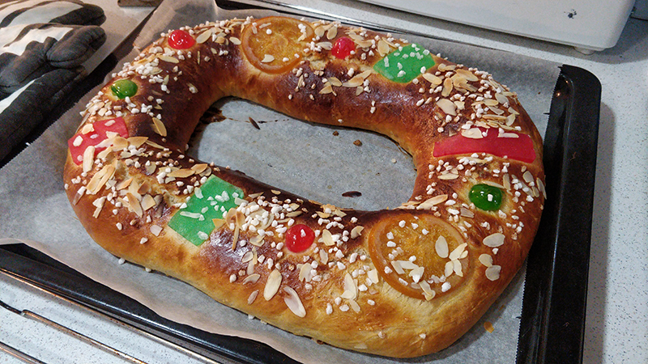

## Roscón de Reyes - Otra versión

**Ingredientes**

*Para el prefermento*

- 90 g de harina común
- 50 g de leche tibia
- 2 g de levadura fresca de panadería o 1 g de levadura seca de panadería

*Para la masa del roscón*

- 340 g de harina de fuerza
- 110 ml de leche tibia
- 2 huevos medianos
- 100-120 g de azúcar
- 5 g de levadura seca de panadero o 15 g de levadura fresca
- 1 cucharadita (teaspoon) de sal
- 60 g de mantequilla a temperatura ambiente
- 2 cucharadas (tablespoons) de ron añejo
- 1 o 2 cucharadas (tablespoons) de agua de azahar

*Para decorar podemos usar*

- Azúcar perlado
- Azúcar mojado
- Almendras laminadas
- Fruta confitada

**Preparación**

*Del prefermento*

Para el prefermento mezclamos todos los ingredientes en un bol hasta obtener una bolita de masa homogénea. Dejamos en el bol reposar una media hora y luego cubrimos con papel film a piel y dejamos reposar en la nevera, un mínimo de 12 horas (entre  12 y 16 horas es lo habitual. Yo lo preparo por la noche y continúo la mañana siguiente.

*De la masa del roscón*

Al día siguiente comprobamos que el prefermento haya fermentado.

En un bol mezclamos la leche, el agua de azahar y el ron. Reservamos.

En otro bol, o el bol de la amasadora equipada con el gancho, ponemos la harina, la levadura, el azúcar y la sal. Añadimos el prefermento troceado y la mezcla de la leche. Amasamos un poco y añadimos los huevos batidos. Amasamos hasta que la masa sea homogénea. Con la amasadora en unos 10 minutos puede estar lista. Si amasamos con las manos, primero amasaremos en el bol y luego pasaremos a la encimera. No añadiremos harina, amasaremos siempre con un poco de aceite en la superficie.

Cuando la masa comience a estar manejable y un poco homogénea, añadiremos la mantequilla en trozos y poco a poco. En este momento la masa se volverá más pegajosa. Haremos pequeños reposos. Amasamos unos 5 minutos y dejamos reposar otros 10, cubriendo la masa para que no se seque. Haremos unos 2 o 3 reposos y conseguiremos una masa elástica y homogénea. También podemos hacerlo con la amasadora, que no requerirá de los reposos.

Una vez que la masa esté elástica, homogénea, lisa y suave, estará lista para ser fermentada. Para fermentar pondremos la masa en un bol engrasado y cubrimos con un film también engrasado o con un trapo húmedo. Dejamos fermentar un par de horas, que doble su volumen aproximadamente.

Cuando haya pasado el tiempo, espolvoreamos la encimera con un poquito de harina, y hacemos un hatillo bien apretado con la masa, y la boleamos. Preparamos una bandeja de horno con papel de hornear. En el centro de la masa abrimos un agujero y con cuidado, vamos abriendo el centro, procurando darle el mismo grosor a todos los laterales del roscón. Tenemos que formarlo muy abierto para evitar que después se cierre durante el horneado. Lo pasamos con cuidado a la bandeja que teníamos preparada, volvemos a cubrir con papel film engrasado y dejamos reposar otras 2 hasta que vuelva a doblar su tamaño aproximadamente.

Precalentamos el horno a 190  ºC, con calor arriba y abajo.

Cuando el roscón haya fermentado, pintamos con huevo y decoramos con lo que más nos guste: azúcar perlado, azúcar mojado, almendras laminadas, fruta confitada, etc. Llevamos al horno unos 20 minutos, controlando muy bien que no se haga demasiado o quedará muy seco.

Una vez frío, podemos cortar y rellenar de nata montada, crema pastelera, nata trufada o de lo que más nos guste.

**Receta de:** [Alma Obregón](https://www.instagram.com/tv/CWabAKQDRPH/)