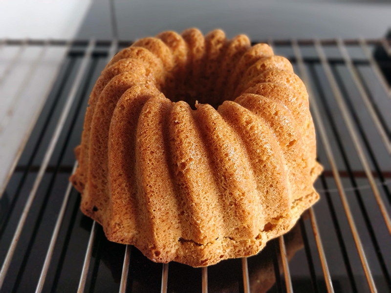

## Speculoos Bundt Cake

**Ingredientes**

- 420 g de harina de trigo
- 1 cucharadita (teaspoon) de levadura química
- 1 cucharadita (teaspoon) de sal
- 500 g de azúcar blanco
- 200 g de mantequilla sin sal a temperatura ambiente
- 200 g de crema de speculoos o Lotus
- 4 huevos camperos a temperatura ambiente
- 120 ml de leche entera a temperatura ambiente

**Preparación**

Precalentamos el horno a 175 ºC, con calor arriba y abajo, y una rejilla en el centro. Preparamos el molde bundt engrasándolo y enharinándolo, o con spray antiadherente. Reservamos.

En un bol tamizamos la harina, la levadura y la sal. Reservamos.

En un bol, o en el bol de la amasadora equipada con la pala, batimos la mantequilla, la crema de speculoos y el azúcar a velocidad media, hasta que esté suave y esponjosa. Añadimos los huevos, de uno en uno, mezclando bien después de cada uno.

Añadimos la mezcla de harina alternando con la leche. Empezamos echando un tercio de la harina, la mitad de la leche, harina de nuevo, terminamos la leche y finalizamos con el resto de la harina. Integramos bien.

Pasamos la masa al molde que teníamos preparado, alisamos la superficie y llevamos al horno durante una hora aproximadamente, o hasta que al pincharlo con un palillo o varilla, ésta salga limpia. Retiramos del horno y dejamos enfriar unos 10-15 minutos sobre una rejilla. Pasado el tiempo desmoldamos y dejamos enfriar por completo sobre la rejilla.

**Molde utilizado:** [molde bundt de 12 cups](../../moldes-y-utensilios.md)

**Receta de:** [I Love Bundt Cakes](http://www.ilovebundtcakes.com/speculoos-bundt-cake/)