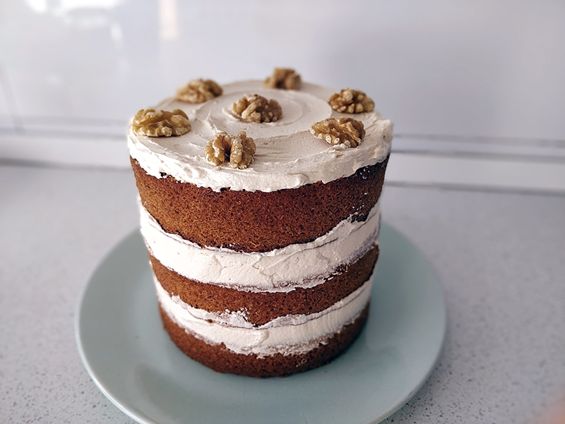

## Tarta de café y nueces

**Ingredientes**

*Para el bizcocho*

- 225 g de mantequilla sin sal
- 225 g de azúcar moreno (si es posible, *light-brown sugar*)
- 4 huevos M/L
- 60 ml de café expresso, recién hecho
- 225 g de harina bizcochona
- 1/4 cucharadita (teaspoon) de sal
- 60 g de nueces troceadas
- 30-60 ml (2-4 cucharadas o tablespoons) de leche para aligerar (opcional)
- Nueces enteras para decorar

*Para el buttercream de café (relleno y cobertura)*

- 170 g de mantequilla sin sal
- 345 g de azúcar glass o *icing sugar*
- 2 cucharadas (tablespoons) de café expresso, recién hecho
- 30-45 ml (2-3 cucharadas o tablespoons) de leche (opcional)

**Preparación**

*Del bizcocho*

Precalentamos el horno a 180 ºC y colocamos una rejilla a media altura. Engrasamos bien, fondo y laterales, los moldes para *layer cake*. Además, recortamos papel de horno con la forma de la base de los moldes, y colocamos los círculos en el fondo de cada molde. Engrasamos también sobre el papel. Reservamos.

Tamizamos la harina junto con la sal y reservamos.

En el bol de la amasadora, equipada con la pala, batimos la mantequilla a velocidad media durante 1 - 2 minutos, hasta que adquiera una textura cremosa y suave. Con ayuda de una espátula de silicona iremos despegando, a medida que avancemos, los restos de masa adherida a las paredes y fondo del bol. A continuación, agregamos el azúcar moreno y seguimos batiendo a velocidad media-alta, hasta conseguir una mezcla esponjosa y ligera y con un color más pálido (3-4 minutos más).

Reducimos la velocidad y añadimos los huevos, de uno en uno, asegurándonos de que cada uno queda bien integrado antes de agregar el siguiente. Volvemos a despegar los restos de masa del cuenco y, en caso de haber utilizado la amasadora, seguimos ahora ya a mano.

Vamos incorporando la harina en dos o tres tantas, mezclando con la espátula y empleando movimientos envolventes. Cuando prácticamente esté casi toda la harina incorporada, añadimos el café y las nueces troceadas mientras terminamos de mezclar, de forma que queden bien repartidas por toda la masa.

Si la masa hubiera quedado demasiado densa (al levantar la espátula, la masa no cayera por su propio peso), añadiríamos un poco de leche hasta que adquiera una consistencia un tanto más ligera.

Dividimos la masa en los moldes, pesando el total de la masa y dividiendo o llenando los moldes de forma pareja con ayuda de una cuchara de helados, por ejemplo. Antes de alisar las superficies con una pequeña espátula angulada (o un cuchillo pequeño o el reverso de una cuchara), daremos unos golpecitos suaves a los moldes contra la encimera (mejor sobre un trapo doblado), para que se liberen las posibles burbujas de aire que pudiera tener la masa.

Horneamos durante 20-25 minutos hasta que los bizcochos hayan subido y hayan adquirido un bonito tono dorado. Antes de sacarlos del horno, comprobaremos si están bien horneados insertando una brocheta o *cake tester* en el centro; si sale limpia ya está listo, si no, vamos comprobando cada poco.

Una vez horneados, retiramos del horno y dejamos enfriar los bizcochos en sus moldes unos 5 minutos sobre una rejilla. Por último, desmoldamos y dejamos enfriar por completo sobre la rejilla.

*De la crema*

En el bol de nuestra amasadora, equipada con la pala, batimos la mantequilla a velocidad media durante 1-2 minutos hasta que quede cremosa y suave.

Tamizamos el azúcar glass y lo vamos añadiendo poco a poco a la mantequilla, batiendo en un principio a baja velocidad para que no se extienda por toda la cocina. Subimos la velocidad y seguimos durante unos 3-4 minutos a velocidad media-alta hasta conseguir una textura ligera y esponjosa.

Añadimos el café y mezclamos hasta obtener una mezcla homogénea. Si fuera necesario, añadiríamos un poco de leche extra, una cucharada tras otra, para aligerar.

*Montaje y decoración*

Si es necesario, nivelamos los bizcochos con un cuchillo de sierra largo o una lira. Podemos limpiar las migas con una brocha de cocina.

Colocamos el primer bizcocho sobre el plato sobre el que se vaya a servir la tarta y, con ayuda de una espátula pequeña angulada (o un cuchillo o el reverso de una cuchara) extendemos uniformemente una buena capa de nuestro *buttercream* de café hasta llegar al borde.

A continuación, repetimos con el segundo bizcocho y una segunda capa de *buttercream*, cuidando de que quede centrado. Por último, colocamos el último bizcocho y terminamos con la última capa de *buttercream*. Por último, decoramos con unas cuantas nueces enteras con el diseño que queramos.

**Notas**

Se puede hacer de café descafeinado perfectamente.

Se conserva a temperatura ambiente, siempre que no sea muy alta, bien cubierta durante 2-3 días, o hasta  4 si se mantiene refrigerada, aunque mejor servir a temperatura ambiente.

Si sobra tarta, se puede cortar en porciones, envolver cada una en papel film y congelar. Para comerla de nuevo, la dejamos a temperatura ambiente.

**Molde utilizado:** [moldes de layer cake de 15 cm de diámetro.](../../moldes-y-utensilios.md)

**Receta de:** [Pemberley Cup & Cakes](https://pemberleycupandcakes.com/2014/11/11/tarta-de-cafe-y-nueces-coffee-walnut-cake/)