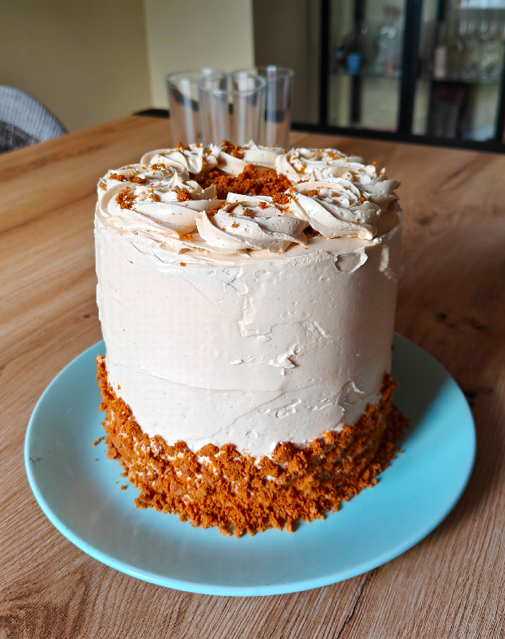

## Tarta de galleta Lotus

**Ingredientes**

*Para los bizcochos*

- 3 huevos M/L
- 275 g de azúcar extrafino
- 175 ml de aceite de girasol
- 300 g de harina de trigo común
- 50 g de galletas Lotus trituradas
- 3/4 cucharadita (teaspoon) de sal
- 1 y 1/2 cucharaditas (teaspoons) de bicarbonato sódico
- 250 ml de *buttermilk*
- 1 y 1/2 cucharaditas (teaspoons) de vinagre de manzana
- 1 y 1/2 cucharaditas (teaspoons) de pasta de vainilla

*Para el merengue suizo*

- 125 g de claras pasteurizadas o frescas
- 200 g de azúcar
- 1/4 cucharadita (teaspoon) de cremor tártaro

*Para la buttercream de merengue suizo con crema de galleta Lotus*

- 350-400 g de mantequilla sin sal a temperatura ambiente, tirando a fría, cortada en cubitos de unos 5 cm
- 1/4 cucharadita (teaspoon) de sal
- 1 cucharadita (teaspoon) de vainilla
- 3 cucharadas (tablespoons) de crema de galleta Lotus

*Para decorar*

- Migas de galleta Lotus o galletas Lotus picadas

**Preparación**

*De los bizcochos*

Precalentamos el horno a 175 ºC. Preparamos tres moldes desmontables de 15 cm engrasados con mantequilla o spray desmoldante. Cubrimos las bases con un círculo de papel de horno del diámetro del molde, engrasado por debajo y por encima. Esto ayudará al desmoldado.

En un bol, tamizamos la harina, la galleta triturada, la sal, el bicarbonato sódico y reservar.

En el bol de la amasadora, batir con las varillas los huevos y el azúcar hasta que hayan espumado y blanqueado.

Añadir lentamente el aceite hasta que se haya incorporado del todo.

Cuando esté incorporado, añadir el vinagre y la pasta de vainilla.

Añadir la harina a la mezcla de los huevos en tres veces alternando con el *buttermilk*, poco a poco, a velocidad baja, para que la masa no quede grumosa. Dejar de batir justo cuando esté integrado.

Dividir esta mezcla entre los tres moldes que tenemos preparados y alisar la parte superior con una espátula.

Hornear aproximadamente unos 25-30 minutos o hasta que al pincharlo con una brocheta ésta salga completamente limpia.

Sacar del horno y dejar reposar en el molde sobre una rejilla durante unos 15 minutos. Pasado este tiempo, sacar los bizcochos de los moldes, dejándolos enfriar boca abajo al menos 25 minutos.

Cuando estén fríos del todo, los envolveremos individualmente en papel film y los guardaremos en la nevera. Al día siguiente, el sabor y la textura de los bizcochos estarán más asentados.

*Del merengue suizo*

Ponemos un poco de agua en un cazo u olla pequeña y llevamos a ebullición. Bajamos el fuego al mínimo y colocamos un bol de cristal o metálico con las claras, el cremor tártaro y el azúcar. El agua no debe hervir y el bol no debe tocar el agua. Las claras se irán calentando con el vapor.

Removemos las claras continuamente con las varillas, ya que de lo contrario se cuajarán, hasta que el termómetro marque 65 ºC. No es necesario batir, con remover es suficiente. Esto podría tardar de 10 a 15 minutos, pero dependerá mucho del tamaño del bol y de la cantidad de claras y azúcar que preparemos.

Retiramos el bol del cazo y vertemos la mezcla en el vaso de la batidora de pie y con las varillas comenzamos a batir a velocidad media aumentando progresivamente la velocidad hasta obtener un merengue brillante y con picos firmes. Este proceso tardará de 6 a 10 minutos, dependiendo de la cantidad de merengue que hagamos. No dejaremos de batir en ningún momento.

*De la buttercream de merengue suizo*

Continuamos batiendo hasta que el bol haya bajado a temperatura ambiente y no esté caliente al tocar con la mano. Una vez atemperado, comenzamos a añadir la mantequilla. Si el merengue o el vaso estuvieran calientes, se derretiría.

Con la velocidad al mínimo, incorporamos los cubitos de mantequilla poco a poco, a puñaditos, dejando que se vayan mezclando con el merengue. Cuando se haya terminado de añadir la mantequilla, aumentamos la velocidad hasta obtener una mezcla suave y sedosa. 

Si tuviera apariencia de huevos revueltos, continuaremos batiendo a velocidad alta, finalmente se arreglará. Si tuviera una consistencia demasiado líquida, es que la mantequilla estaba muy blanda. Meteremos el vaso de la batidora en la nevera unos 15 minutos, tras lo cual, continuaremos batiendo a velocidad alta hasta que el *buttercream* coja cuerpo y una textura suave y sedosa.

Añadimos la sal, la vainilla y la crema de galleta Lotus. Batir hasta que se integre del todo.

*Montaje y decoración*

En el plato donde vayamos a presentar la tarta, ponemos un poquito de crema, que sirva de pegamento, y la primera capa de bizcocho, el menos perfecto de los tres. Cubrimos este bizcocho con una capa de crema (podemos usar una manga pastelera sin boquilla para ayudarnos), alisando y extendiendo con una espátula, intentando dejar una capa de grosor uniforme. Si la crema sale un poco por los laterales no importa, ya que nos ayudará a rematar la tarta más tarde.

Colocar los dos siguientes niveles con el bizcocho hacia abajo (sin olvidarnos de la capa de crema), dejando la base plana hacia arriba, aplastándolos ligeramente con la mano para que se asienten y no se muevan.

Para los laterales, colocamos crema con la ayuda de la manga pastelera, desde abajo hacia arriba, terminando por la parte superior. Con ayuda de una espátula o rasqueta, intentamos alisar lo máximo posible la crema. Si el efecto que queremos darle es más rústico, no hace falta alisarlo perfectamente.

La primera capa debe quedar muy fina para que selle y aguante las miguitas del bizcocho. Dejamos enfriar la tarta en la nevera unos 30 minutos. Si queremos dejar un efecto *naked*, podemos dejar la tarta así.

Si no, pondremos una generosa capa de crema a la tarta. Es mejor trabajar con gran cantidad que con poca, y se la iremos quitando a medida que vamos alisando. Trabajaremos de abajo arriba, tanto en la parte superior como en los laterales.

Por último, decoramos la parte inferior de la tarta con migas de galleta triturada. Con una boquilla de estrella (yo utilicé la 1M de Wilton), hacemos unas rosas en la parte superior de la tarta y decoramos cada una con migas de galleta Lotus. Servimos.

**Notas**

Si no encontramos *buttermilk* podemos prepararlo vertiendo el zumo de medio limón (o 1 cucharada o tablespoon de vinagre) sobre 250 ml de leche entera tibia. Sin remover, dejamos reposar unos 15-20 minutos, hasta que se corte y espese. Tendrá aspecto de leche cortada o yogur muy líquido, pero ésta es la textura que debe tener. Revolvemos cuando vayamos a usar, no es necesario colar.

Entre capa y capa de bizcocho, además de la crema, podemos añadir migas de galleta Lotus para darle un toque crujiente.

Podemos preparar la crema el día antes y conservarla en la nevera. Para usarla, dejaremos que vuelva a temperatura ambiente y la batiremos un poco para que vuelva a estar suave y sedosa.

**Molde utilizado:** [moldes de layer cake de 15 cm de diámetro](../../moldes-y-utensilios.md)

**Receta de:** [Bea Roque, libro Fiesta](https://elrincondebea.com/2020/10/tarta-de-galleta-lotus.html)