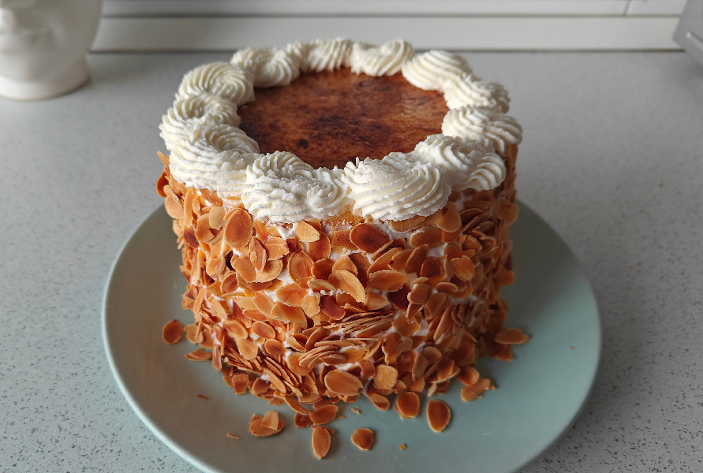

## Tarta San Marcos

**Ingredientes**

*Para el bizcocho*

- 4 huevos M/L
- 145 g de azúcar blanco
- 165 g de harina de repostería
- 3 cucharadas de mantequilla fundida

*Para el relleno*

- 600 g de nata para montar, 35% m.g.
- 160 g de azúcar
- 2 cucharadas (tablespoons) de cacao puro en polvo

*Para el almíbar de calar*

- 200 g de azúcar
- 200 g de agua
- Un chorrito de zumo de limón

*Para la cobertura de yema tostada*

- 180 g de azúcar
- 60 g de agua
- Un chorrito de zumo de limón
- 1/2 cucharadita (teaspoon) de extracto puro o pasta de vainilla
- 4 yemas
- 7 g de harina fina de maíz
- Azúcar para tostar
- 100 g de almendras fileteadas y tostadas para decorar

**Preparación**

Si las almendras no están tostadas, las tostamos con cuidado en el horno, extendidas sobre un papel de horno, con cuidado de que no se quemen. Reservamos.

*Para el bizcocho*

Calentamos el horno a 180 ºC con calor arriba y abajo. Preparamos los moldes con spray desmoldante y un círculo de papel de horno en la base, con spray también encima del papel.

En el bol de la amasadora, equipada con las varillas, batimos los huevos y añadimos el azúcar y la sal. Montamos hasta blanquear o alcanzar el punto de cinta. Retiramos el bol de la amasadora.

Añadimos la harina, previamente tamizada, y mezclamos de forma envolvente con una espátula. Añadimos la mantequilla fundida, mezclamos un poco más y repartimos la masa entre los tres moldes.

Horneamos hasta que al pincharlos con una varilla, ésta salga limpia, unos 30 minutos aproximadamente.

Retiramos del horno, dejamos que repose 10 minutos sobre una rejilla y los desmoldamos para que se enfríe.

Si no han quedado planos del todo, podemos igualarlos con la lira.

*Para el relleno*

Montamos la nata con el azúcar y la dividimos en dos cuencos. A uno de los cuencos le añadimos el cacao puro en polvo y reservamos ambos cuencos en la nevera.

*Para el almíbar de calar*

Ponemos todos los ingredientes en un cazo y llevamos a ebullición. Apagamos el fuego cuando se haya diluido el azúcar, dejamos enfriar y lo pasamos a una taza u otro recipiente para usarlo más tarde.

*Para la cobertura de yema tostada*

Ponemos en un cazo el agua, el azúcar, el zumo de limón y el extracto de vainilla, y llevamos a ebullición. Bajamos el fuego y dejamos cocer durante 5 minutos, aproximadamente. Retiramos del fuego y dejamos templar un poco.

Batimos las yemas con la harina fina de maíz y echamos el almíbar, mezclamos y pasamos por un colador.

Cocemos la preparación a fuego muy suave, mejor si lo hacemos al baño María, hasta que espese. Retiramos del fuego y reservamos. Tener en cuenta que una ves se enfríe espesará un poco más.

*Para el montaje de la tarta*

Humedecemos bien el primer bizcocho con el almíbar y cubrimos con la nata trufada.

Cubrimos con otra capa de bizcocho, humedecemos bien con almíbar y rellenamos con tres cuartos de la nata montada. El resto lo guardamos para cubrir los bordes y la decoración final.

Tapamos con la tercera capa de bizcocho, humedecemos con almíbar y alisamos los bordes con una espátula. En este momento podemos terminarla o guardar en la nevera.

Añadimos la cobertura de yema por toda la superficie de la tarta, espolvoreamos con azúcar y la tostamos con un soplete de cocina.

Cubrimos los bordes con un poco de nata montada de la que habíamos reservado, y el resto lo metemos en una manga pastelera con una boquilla rizada, o la que queramos usar para decorar.

Tapamos todo el lateral de nata de la tarta con las almendras tostadas, y decoramos el borde de la tarta con la manga pastelera.

Refrigeramos al menos 2 horas antes de servirla.

**Notas**

Yo he montado la tarta con 3 moldes de 15 cm, pero la receta original se da para un molde alto de 20 cm de diámetro.

Los bizcochos los podemos hornear el día antes y dejarlos envueltos en film en la nevera hasta que vayamos a montar la tarta. En ese momento los igualamos si es necesario.

Para montar la nata es aconsejable que ésta esté fría, al igual que las varillas y el bol donde se vaya a montar.

**Molde utilizado:** [moldes de layer cake de 15 cm de diámetro](../../moldes-y-utensilios.md)

**Receta de:** [María Lunarillos](https://www.marialunarillos.com/blog/receta-de-tarta-san-marcos-paso-a-paso.html)