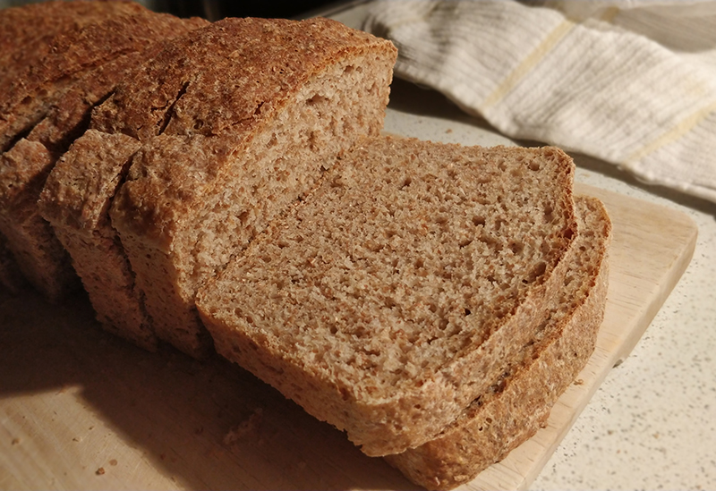

## Pan de molde integral con semillas

**Ingredientes**

- 280 g de harina integral
- 250 g de harina panificable
- 4 g de levadura seca de panadero o 12 g de levadura fresca
- 370 ml de agua
- 20 ml de aceite de oliva
- 1 + 1/2 cucharaditas (teaspoons) de sal
- 1 cucharada (tablespoon) de miel
- 3 cucharadas (tablespoons) de mezcla de semillas

**Preparación**

En el bol de la amasadora mezclamos el agua con la miel y la levadura, y dejamos reposar 5 minutos.

Añadimos los dos tipos de harina y la sal, y mezclamos muy bien con el gancho de la amasadora, hasta que la masa sea homogénea y elástica. Incorporamos el aceite y las semillas. Amasamos unos 10 minutos más, a velocidad media-baja. La masa se despegará de las paredes del bol.

Una vez la masa está elástica y suave hacemos un hatillo, la pasamos a un bol engrasado, y la dejamos fermentar cubierta en torno a 2 horas en una zona cálida de la casa o toda la noche en la nevera. En ese momento desgasificamos y estiramos la masa en un cuadrado. Enrollamos sobre sí misma y dejamos fermentar en un molde de plum cake o loaf bien engrasado.

Una vez la masa esté llegando cerca del borde, precalentamos el horno y horneamos 15 minutos a 210 ºC con calor arriba y abajo, y 25 minutos a 180 ºC.

Dejamos enfriar unos minutos en el molde y después por completo sobre una rejilla.

**Notas**

Si estamos amasando a mano, engrasamos las manos con aceite, y también la superficie, para evitar que se pegue. En el amasado podemos hacer pequeños reposos de 10 minutos entre nuestros amasados, siempre con la masa cubierta durante el reposo, para facilitar la labor, ya que es una masa pegajosa al inicio.

La harina panificable es la que tiene 10-11 g de proteína.

La harina de repostería tiene en torno a 9 g de proteína, también llamada harina floja.

La harina de fuerza tiene en torno a 12 g o más de proteína.

Podemos cortar todo el pan en rebanadas y congelarlo. En el momento de comerlo podemos tostarlo y estará como recién hecho.

**Molde utilizado:** [Molde loaf o de pan](../../moldes-y-utensilios.md)

**Receta de:** [Alma Obregón](https://www.instagram.com/p/CO5FkufMq5G/)