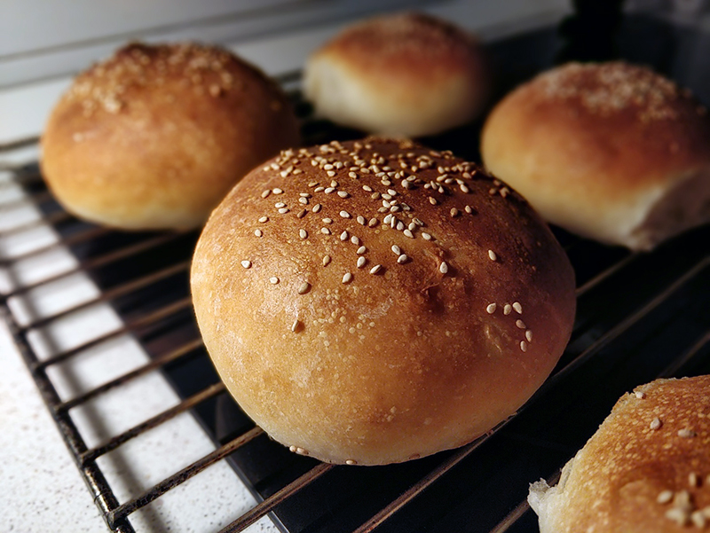

## Panecillos de hamburguesa

**Ingredientes**

- 420 g harina panificable
- 200 ml de agua
- 25 g de mantequilla blandita
- 1 huevo
- 40 de miel
- 8 g de levadura seca o 24 g de levadura fresca
- 1 cucharadita (teaspoon) de sal

*Para pintarlos*

- Un huevo
- Semillas de sésamo

**Preparación**

Ponemos todos los ingredientes juntos en el bol de la amasadora equipada con el gancho y amasamos hasta tener una masa súper elástica y homogénea.

Pasamos a un bol engrasado y dejamos fermentar tapado con un film, también engrasado, hasta que doble su volumen.

Desgasificamos y boleamos sobre una superficie enharinada. Cortamos la masa en 8 porciones que pesen unos 90 g cada una, aproximadamente. Boleamos cada porción y la aplastamos bien antes de colocarla en sobre una bandeja cubierta con papel de horno. Dejamos fermentar los panes cubiertos con papel film engrasado.

Precalentamos el horno a 190 ºC con calor arriba y abajo. Pintamos con huevo cada pan y espolvoreamos con sésamo. Horneamos 15-17 minutos o hasta que estén dorados.

**Notas**

La harina panificable es la que tiene 10-11 g de proteína.

En caso de amasar a mano, empezaremos con una espátula de madera y después amasaremos sobre una superficie engrasada con aceite durante 3-4 minutos (las manos también con aceite), y haremos 2 o 3 reposos de 10 minutos para facilitar la labor (durante los reposos podemos cubrir la masa con un bol o trapo).

**Recetas que utilizan panecillos de hamburguesa**

- [Hamburguesas caseras](../salado/hamburguesas-caseras.md)

**Receta de:** [Alma Obregón](https://www.instagram.com/p/C3TLnEWMd1B/)