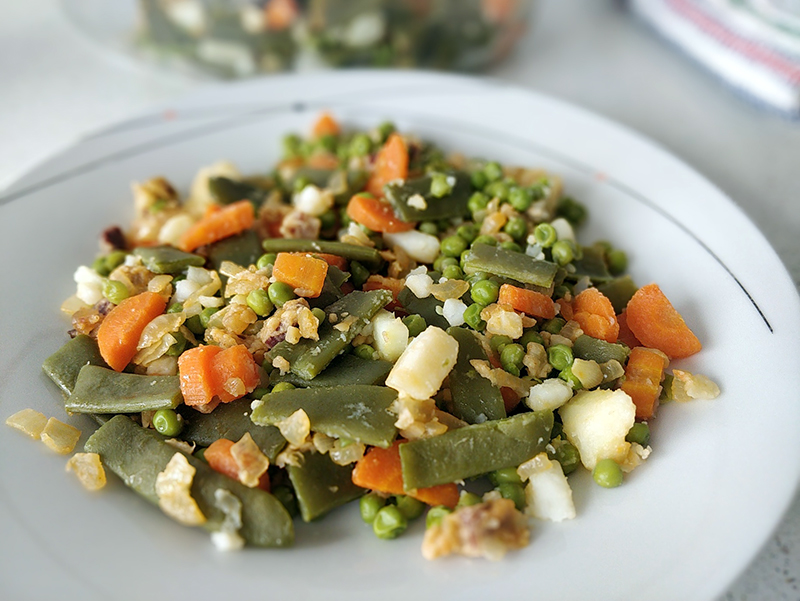

## Menestra de verduras

**Ingredientes**

- 1 patata grande
- 1 cebolla mediana
- 2 zanahorias
- 400 g de habichuelas verdes
- 275 g de guisantes
- 275 g de coliflor
- 100 g de jamón serrano en taquitos
- 1 cucharada de harina
- Agua
- Sal
- Un chorrito de aceite de oliva virgen extra

**Preparación**

Pelamos las patatas, las zanahorias y la cebolla. Las lavamos y las cortamos en brunoise (dados pequeños), para que se mezcle todo bien. Cortamos las judías verdes y la coliflor.

En una olla ponemos agua para cubrir las verduras, un chorrito de aceite de oliva virgen extra y un poco de sal. Calentamos a fuego alto y cuando esté hirviendo, añadimos las verduras troceadas (zanahorias, judías verdes, guisantes) y mantenemos cociendo a fuego medio durante 30 minutos aproximadamente.

Las patatas y la coliflor se añadirán cuando lo anterior lleve 10 minutos, ya que con 18-20 minutos de cocción será suficiente.

Mientras se cuecen las verduras, ponemos aceite de oliva en un sartén y empezamos con el sofrito. Lo calentamos a fuego medio y añadimos el jamón y la cebolla. Sofreímos. Añadimos una cucharada de harina y removemos bien. A continuación añadimos dos cucharadas del caldo de la cocción de las verduras y mantenemos unos minutos a fuego bajo. Una vez la cebolla está transparente y el jamón dorado, retiramos la sartén del fuego. Reservamos.

Cuando las verduras estén cocidas las retiramos del fuego, las escurrimos y las colocamos en una fuente. Añadimos el sofrito encima de las verduras. Servimos la menestra de verdura y la aliñamos con aceite de oliva virgen extra o si preferimos con vinagre o mayonesa. Podemos acompañar nuestra menestra con huevo duro, dados de pan frito o un huevo escalfado.

**Notas**

Podemos hacer la menestra de las verduras que más nos gusten o estén de temporada: alcachofas, coles de Bruselas, patata, espárragos, cebolletas, judías verdes, guisantes, habas, espinacas, borrajas, calabacines, etc. Con 5 o 6 verduras es suficiente, para apreciar os sabores de cada una. También podemos cocer cada verdura por separado para dejarlas al dente.

Al sofrito le podemos añadir un poquito de ajo o ajetes frescos y darle un toque de pimentón dulce.

**Receta de:** [Recetas de rechupete](http://recetasderechupete.hola.com/menestra-de-verdura-con-jamon/12501/)