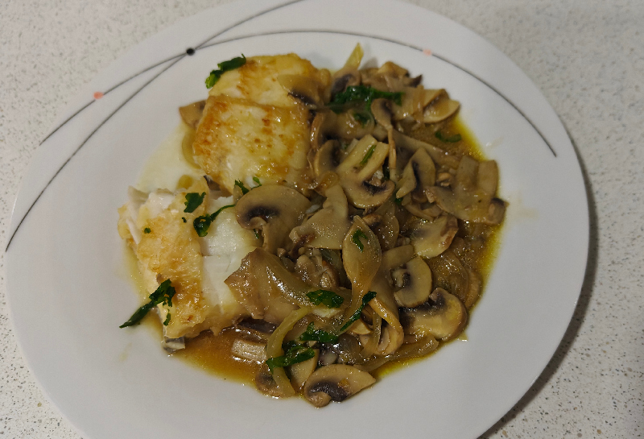

## Merluza con champiñones y cebolla

**Ingredientes**

- Lomos o medallones de merluza
- 2 cebollas
- Champiñones laminados
- Aceite de oliva virgen extra
- Harina
- Ajo en polvo
- Agua
- Pastilla de caldo de verduras
- Perejil fresco

**Preparación**

En una sartén grande ponemos el aceite y pochamos la cebolla cortada en juliana con los champiñones laminados. Cuando esté dorado, añadimos ajo en polvo al gusto.

Pasamos los trozos de merluza por harina y los doramos un poco por ambos lados, en la misma sartén de la cebolla y champiñones.

Añadimos el agua y la pastilla de caldo de verduras y dejamos al fuego hasta que se forme una salsa. Espolvoreamos con perejil fresco picado y servimos.

**Notas**

Podemos usar caldo de verduras casero en vez de agua y la pastilla de caldo.

**Receta de:** [Petitchef](https://www.petitchef.es/recetas/plato/merluza-con-salsa-de-cebolla-y-champinones-fid-525509)