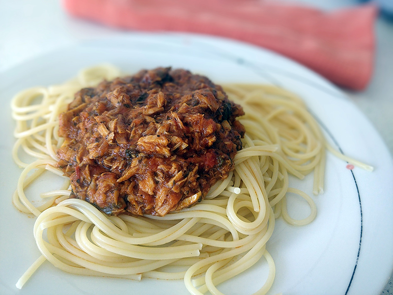

## Pasta a la corsaria

**Ingredientes**

- 1 diente de ajo
- 1 cucharada de albahaca seca
- 1 cucharadita de perejil picado
- 2 latas de atún
- 6-7 cucharadas tomate natural triturado
- 1 cucharada de orégano
- Pimienta negra molida
- Medio vaso de vino blanco
- 150 g de pasta
- Sal

**Preparación**

En una sartén sofreímos el ajo en láminas, la albahaca y el perejil. Cuando el ajo esté dorado, agregamos el atún escurrido, el tomate, el orégano y la pimienta. Dejamos hacer unos minutos removiendo con cuidado. Añadimos el vino blanco, y cuando evapore el alcohol y coja un poco de consistencia, retiramos del fuego.

Por otro lado cocemos la pasta en agua hirviendo con sal, la dejamos el tiempo que indique el fabricante o cuando esté a nuestro gusto, escurrimos (sin echarle agua fría) y la añadimos a la salsa mientras está caliente.

Añadimos queso rallado si queremos al servir.

**Notas**

El tomate natural triturado lo podemos sustituir por salsa de tomate casera.

**Receta de:** Joaquín Martín