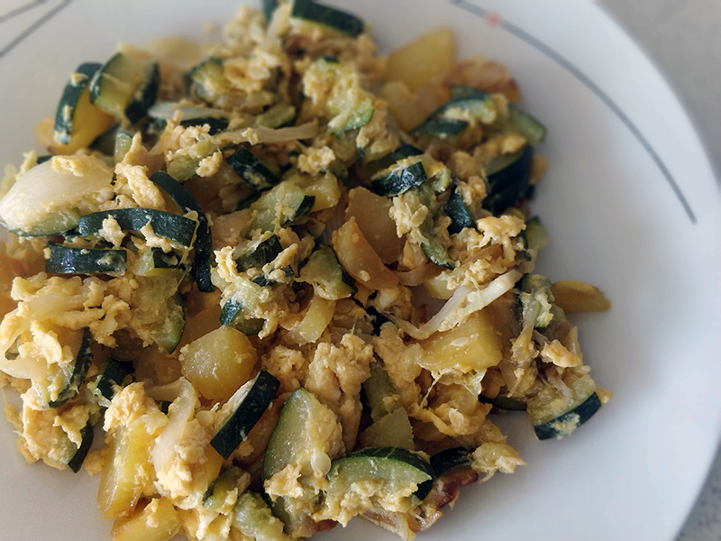

## Revuelto de calabacines y patatas

**Ingredientes**

- Media cebolla
- Aceite de oliva
- 2 calabacines
- 2 o 3 patatas
- Sal
- 2 huevos L

**Preparación**

Picamos la cebolla y pochamos en una sartén con un poco de aceite de oliva a fuego medio. 

Pelamos y picamos en dados los calabacines y las patatas, y lo añadimos a la sartén cuando la cebolla esté lista. Añadimos un poco de sal, tapamos y ponemos a fuego medio. Esperamos a que todo se ponga tierno, removiendo de vez en cuando para que no se queme. Si cuando ya esté tierno aún no se ha evaporado el caldo que hayan soltado los calabacines, lo quitaremos con cuidado volcando la sartén. 

Añadimos los huevos y removemos. Podemos añadir un poco de queso rallado por encima en el momento de servir.

**Notas**

Las cantidades son las que utilizo para dos personas.

Podemos dejar el calabacín con piel, pelarlo entero o dejarlo con algunas tiras de piel, como prefiramos.

**Receta de:** Mamá