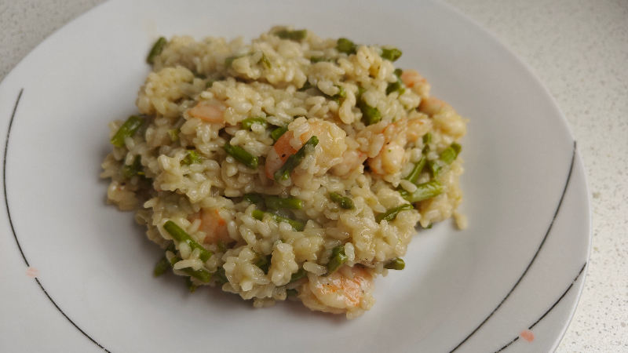

## Risotto de langostinos y espárragos trigueros

**Ingredientes**

- 250 g de arroz arborio, carnaroli o redondo
- 750 ml de caldo de verduras o agua
- Media cebolla, finamente picada
- 2 dientes de ajo picados
- Un manojo de espárragos trigueros
- 10 langostinos o alguno más, crudos y pelados
- Sal
- Pimienta negra molida
- Cebollino fresco picado (opcional)
- Aceite de oliva virgen extra
- Queso Grana Padano rallado

**Preparación**

En una cazuela o sartén grande calentamos un poco de aceite y pochamos la cebolla y el ajo unnos 5 minutos. Añadimos un poco de sal.

Añadimos los espárragos troceados, los langostinos y cocinamos 5 minutos.

Mientras, ponemos a calentar el caldo de verduras en un caso o en el microondas.

Añadimos el arroz a la cazuela y lo rehogamos a fuego medio un par de minutos, removiendo constantemente.

Incorporamos suficiente cantidad de caldo o de agua para cubrir el arroz. Debe estar caliente para no cortar la cocción. Removemos constantemente el arroz con delicadeza, y dejamos que el caldo se consuma antes de incorporar el siguiente cazo.

Hay que ir añadiendo el caldo poco a poco y removiendo durante unos 18 minutos en total, o hasta que el arroz esté al dente. En ese momento retiramos del fuego y añadimos el queso. Removemos para mantecar el risotto y que quede cremoso.

Salpimentamos al gusto y servimos de inmediato con un poco de cebollino picado por encima.

**Notas**

Podemos usar Pecorino romano o parmesano en vez de Grana Padano.

**Receta de:** [Marikowskaya]()